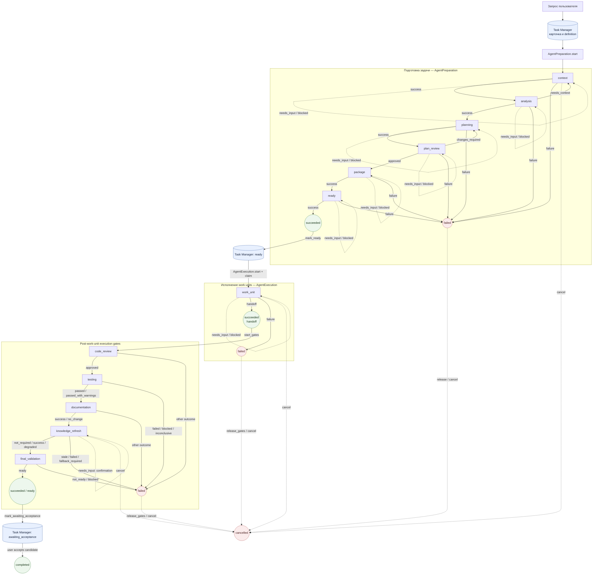

# Обзорный граф Orchestrator

**Статус:** схема фактически реализованного агентского пути, 2026-09-18.

Схема объединяет три связанных графа: подготовку задачи до `ready`, исполнение work units и post-work-unit execution gates. Смысловые решения принимает внешний агент; runtime проверяет результаты, revision, waits, budgets и переходы. `Task Manager` хранит состояние задачи, а `AgentGraphRuntime` — состояние текущего in-memory запуска.

## Как читать схему

- Пунктирные стрелки показывают паузу или отмену. `needs_input` и `blocked` сохраняют текущий узел; после `resume_wait` агент повторно подаёт обычный результат того же узла.
- `required_outputs_by_outcome` влияет на проверку результата внутри любого узла, но не меняет маршрутизацию.
- Подтверждение полной переиндексации в `knowledge_refresh` имеет runtime-outcome `needs_input`; доменный статус внутри результата остаётся `awaiting_confirmation`.
- `succeeded` процесса ещё не означает завершение задачи. После gates создаётся acceptance candidate, а `completed` появляется только после явной пользовательской приёмки.
- `cancelled` доступен из любого нетерминального запуска через актуальные revision/task guards; файлы агента автоматически не откатываются.

Источники переходов: `orchestrator/preparation_primitives.py`, `orchestrator/agent_execution.py`, `orchestrator/execution_gates.py`, `orchestrator/knowledge_refresh_node.py` и действующие контракты в `docs/architecture/`.
